V2Ray一个优秀开源网络代理工具，可帮你畅爽体验互联网，目前已经全平台支持 Windows、Mac、Android、IOS、Linux  等操作系统的使用。相对起 Shadowsocks 来说属于后起之秀，在混淆能力、兼容性、速度上有着独到的优点。在目前  Shadowsocks、ShadowsocksR 停止更新的情况下，多掌握一个活跃项目工具的使用是完全有必要的。


## 前言

本文最后一次更新时间为：**2020-6-25**

本文起初于2016年，时至如今收到很多读者的反馈，经过不断的完善字数也从一两千到现在的一万三千字！这种完善也产生了副产品，许多章节并不是每个人都需要的，即使经过结构化的梳理对他们来说仍会产生的干扰和混淆。

于是我重新写了一篇教程，不做过多的描述，仅写最基础的使用和操作。我知道你不关心它是什么和为什么，只关心怎么做才能正常的访问 Google，那么请移步看我新写 **[面向新手的V2Ray搭建指南](https://yearliny.com/v2ray-build-guide-for-novices/)** 这篇对新手更友好的教程。

我将尽量避免这两篇文章的重复，所以那篇文章只会讲述最基本的安装和使用，这一篇文章才涉及到配置讲解，所以那篇文章未涉及到的内容，你可以综合两篇文章一起看。

## 一、V2Ray（Project V）介绍

> Project V 包含一系列工具，帮助你打造专属的定制网络体系。
>
> v2ray.com

和Shadowsocks一样，V2Ray的运行需要服务端和客户端的相互支持，也就是说除了你正在使用的设备，你还需要配置一个境外远程服务器。这个过程并不是很简单，需要付出你的一点点努力才能完成，所以我在这里分享出我的使用经验，与君共勉。

### 1-2、和Shadowsocks有什么区别

V2Ray 更像是一个集成工具，它集合了多种多样的协议和功能，对个人用户而言像是一个工具箱，可以使用各种各样的工具组合。对开发者而言像是一个脚手架，可以在此基础上开发扩充自己需要的功能而节省开发时间。

总而言之大体上的道理是相同的，你若是需要个性化的功能，那么需要更复杂的配置，若是需要最基本、普遍的功能，只需要在已有基础上稍作修改即可。

## 所需工具：

### 境外VPS：

#### 地域选择

任何境外 VPS 都可以，一般而言香港、台湾、新加坡、韩国、日本等亚洲机房速度（延迟小）最快，但价格贵并且由于用的人多经常会被重点关照。无论如何，如果预算充足并追求速度可以选择这些机房，但需要提前了解测试线路是否是直连中国，一些线路可能会绕美国。

美国VPS价格低廉宽带足，其中的~~洛杉矶(Los Angeles)、西雅图(Seattle)~~两个机房对中国物理距离最近，这两个机房为首选。

由于用洛杉矶和西雅图机房的人太多，这两个机房的许多 IP 已经被 BAN 了，或者速度十分缓慢，当你这两地的机房却无法连接或速度缓慢，请考虑连接其他机房，如纽约(New York)、迈阿密(Miami)。

退一步说话，就目前的网络优化技术下（推荐BBR），延迟对实际感觉到的网速而言存在感并不够强烈，所以更值得注意掉包率。最差的情况下（网络优化前），**延迟不高过350，掉包率不超过15%**，这样就已经能满足大多数人的网络体验了。

所以选购VPS时，大多数人并不需要太过追求于日本、香港线路，追求各种CN2优化的极致速度，大多数VPS实际上就已经能满足需求了，前提是开启BBR优化，这一点很重要。

### 商家选择

[](https://www.vultr.com/?ref=8377001-6G)点击图片进入官网注册账户

限时活动：**新用户注册并充值 25 美元**（使用Paypal或信用卡充值）可以获得**额外 100 美元**用于测试使用 Vultr，冲一返二的活动并不常见，这个时候可以入手。

如果你已经有了 Vultr 账号还想薅羊毛，可以重新注册一个新账号，使用不同的邮箱和充值渠道，以躲避 Vultr 的作弊检测。

 [Vultr](https://www.vultr.com/?ref=8377001-6G) 支持支付宝、微信付款（付款时选择 Alipay、Wechat Pay），多地机房选择最低月付 2.5$（IPV6 only）起，按小时计费可随时删除创建多个 VPS，意味着实际上无流量限制，通过备份快照，删除再还原 VPS 的方式可以重置流量。

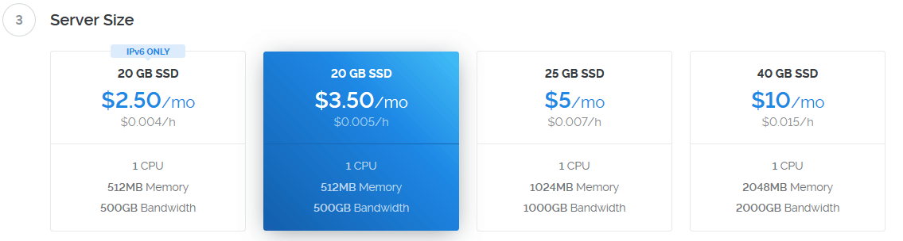

目前 Vultr 中合适的套餐选择是月付 3.5$ 的套餐，购买VPS后，推荐安装 Ubuntu 系统，因为简单易用且教程丰富，遇到问题容易找到解决方法，接下来的服务端部署教程全部基于 Ubuntu 18.04 环境。

Vultr 中的 Ubuntu 18.04 LTS 已经默认启用了 BBR 加速，所以无需再进行额外配置，只需要部署 V2Ray 即可食用。

### 耐心+加油

若有 Linux 系统（如 Ubuntu） 使用经验，那么这个过程对你来说是轻而易举。即使你没有太多电脑基础也没有关系，跟着本文进行操作，遇到不懂的问题善于使用搜索，或者在本文**下方的评论区留言**求助，相信机智的你可以轻松搞定。

### 写给新手

一些新手遇到了问题往往不知道如何解决，并且求助于我并解决问题后，发现很多问题所在都是配置不按照教程走（或许是从别处看的有失误的配置）。本文在下方手动安装环节展示了完整的服务端配置，并且在下方 3-3Linux 章节（客户端配置均通用，Windows用户可直接复制粘贴）中展示了完整的客户端配置。

**当你无法理解配置的含义时，完全跟着教程的配置是最保险的选择**，成功的运行是一个大前提。当你已经掌握用法并且想要更深一步的折腾时，可以跟着官方教程一步一步摸索。

另外由于 V2Ray 的更新，个别配置可能会产生变动或者客户端与服务端的不兼容，所以为了避免不必要的麻烦，请总是使用 V2Ray 最新版本的客户端和服务端。

#### 我可以使用其他系统吗？比如 Centos

是的你可以使用，但是许多新手并不清楚 Centos 默认开启防火墙，这意味着即使你安装好 V2Ray 并运行后仍然无法进行连接，因为防火墙阻断了他们之间的连接。

当你并不熟悉 Centos 时，我建议关闭系统防火墙，因为当你不熟悉系统操作时，防火墙给你带来的负担远大于好处。如果你确定要关闭防火墙，那么运行下面两个命令即可：

```
#停止firewall
systemctl stop firewalld

#禁止firewall开机启动
systemctl disable firewalld
```

## 二、服务端搭建过程

开始讲解在VPS上部署V2Ray的过程。**大多数情况下推荐使用自动安装脚本**，当你无法使用脚本安装成功后，可以跟随 2-2部分内容手动安装。

要进行下面的搭建过程当然需要先 ssh 连接我们预先购买的 VPS，如果你当前使用的是 Win10 系统，不妨使用自带的 ssh 客户端用于连接远程主机。使用方法参考：[使用Win10内置SSH客户端](https://yearliny.com/windows-10-built-in-ssh-commands/)

### 2-1自动安装脚本（推荐）

V2Ray 官方维护并提供了适用于大多数主流系统的自动安装脚本，只需一行命令即可完成安装，当你想要更新V2Ray 的时候同样只需要运行下面一行命令。（谨慎使用第三方的安装脚本）

```
bash <(curl -L -s https://raw.githubusercontent.com/v2fly/fhs-install-v2ray/master/install-release.sh)
# 上列命令会自动安装 V2Ray，然后执行下面命令运行
systemctl start v2ray
```

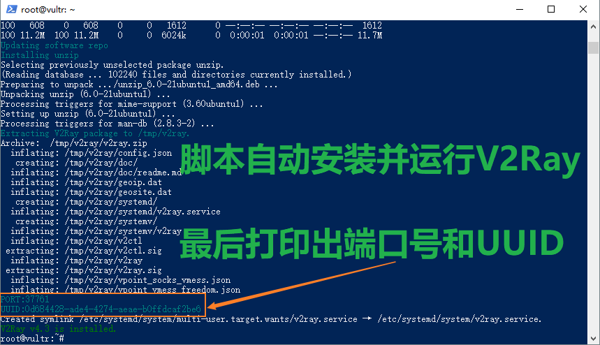

安装完成后会新增下列文件：

- /usr/bin/v2ray/v2ctl：V2Ray 工具，用于给程序自身调用
-  /usr/bin/v2ray/v2ray：V2Ray 核心程序
-  /etc/v2ray/config.json：配置文件
-  /usr/bin/v2ray/geoip.dat：IP 数据文件，V2Ray 路由功能时有用，下同
-  /usr/bin/v2ray/geosite.dat：域名数据文件

脚本安装完成无误后，可以进行如下操作：

1. 编辑 vim /etc/v2ray/config.json 文件来配置你需要的代理方式；
2.  运行 systemctl start v2ray 来启动 V2Ray 进程；
3.  之后可以使用 systemctl start|restart|stop|status v2ray 控制 V2Ray 的运行。

以上命令均需要 root 权限。对于第一步编辑配置文件，可以改动端口为三位数或更小的数字（如443端口）对速度也许有所改善，这是一种玄学 : ) 。

当你使用自动脚本安装结束后，就可以说服务端的部署已经完成了，自动脚本不仅安装了 V2Ray，还在配置中随机生成了一个 5 位数端口以及  UUID 供我们直接使用，所以我们无需进一步配置服务端，我们已经获得三个必要的信息了：IP、端口（Port）、id（UUID）。

若需要支持 Shadowsocks，则需要进一步配置，可以参考下面章节 **2-2手动安装** 中的部分。V2Ray 服务端支持同时配置多种协议，你可以在一个端口配置Vmess协议，一个端口配置 Shadowsocks 协议。配置 Shadowsocks 协议后，你也可以使用其他 SS 客户端而非一定要使用 V2Ray 的客户端。

### 2-2手动安装

手动安装和自动安装达到的效果基本一致，但是许多脚本自动完成的地方却需要我们自己操作，不建议自己手动安装，仅仅在自动安装失败后再尝试。

#### 2-2-1下载与安装

首先 SSH 连接上自己的 VPS，然后到 [Releases](https://github.com/v2ray/v2ray-core/releases) 找到适合自己 VPS 系统的版本，在下载链接上右键复制链接。

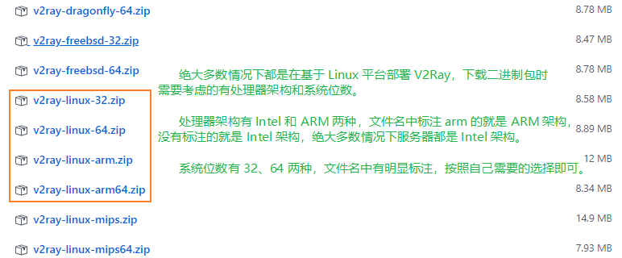

**大多数情况下，VPS的CPU都是Inter架构，而系统位数则已经在购买VPS时就已经选择了，所以下列查询架构和运行模式的部分只在不确定的时候再进行。**

那么如何判断 CPU 型号以及运行模式（32 还是 64）呢？可以通过命令很方便的查询，比如来查询 CPU 运行模式：

```
getconf LONG_BIT
32
```

返回的 32 表明运行模式为 32 位，查询 CPU 型号也只需要一行命令：

```
lscpu | grep "Model name"
Model name: 2 Intel(R) Xeon(R) CPU E5620 @ 2.40GHz
```

下列命令是下载 64 位版本的 V2Ray 主要过程，随后进行详细说明（这里的配置文件“vpoint_vmess_freedom.json”对应自动安装脚本中的 /etc/v2ray/config.json，二者完全相同）：

```
# 创建一个目录并进入
mkdir v2ray;cd v2ray
# 下载压缩包
wget https://github.com/v2ray/v2ray-core/releases/download/v4.16.0/v2ray-linux-64.zip
# 解压压缩包
unzip v2ray*.zip
# 复制安装包中的配置文件到 /etc/v2ray 目录中
cp vpoint_vmess_freedom.json /etc/v2ray/config.json
# 创建一个目录用来储存日志文件
mkdir /var/log/v2ray/
# 运行，默认在 /etc/v2ray/config.json 寻找配置文件
./v2ray
```

不出意外就能看到下面的界面：

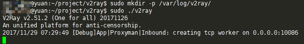

为了方便接下来的使用，我们还是按照文件的存放约定把配置文件放到 etc 路径下（这里忽略官方的示例配置文件，使用文章下方的配置,这里仅仅创建一个文件），可执行文件文件放到 /usr/bin 路径下：

```
sudo mkdir /etc/v2ray /usr/bin/v2ray /var/log/v2ray # 创建目录
sudo chmod +x v2ray v2ctl # 赋予可执行权限
sudo mv v2ray v2ctl geoip.dat geosite.dat -t /usr/bin/v2ray # 移动文件
touch /etc/v2ray/config.json # 仅创建配置文件的空文件
sudo mv systemd/v2ray.service /etc/systemd/system/
sudo systemctl enable v2ray # 用于程序开机启动并且崩溃时自动重启程序
```

OK，经过上列的操作，我们的 V2Ray 和用脚本自动安装的达到的效果已经基本一致了，注意此时的最后一条命令是让 V2Ray 永久运行并且开机启动，但是执行此命令时并未让它启动（还没有配置 config.json 当然不会启动）。

我们需要接着下面的步骤来修改我们的配置文件，每次配置改动都需要重启程序使其生效，执行命令：

```
sudo systemctl restart v2ray
```

### 2-3、配置 V2Ray

通过下方命令编辑配置文件：

```
vim /etc/v2ray/config.json
```

服务端配置如下：

```
{
  "inbounds": [
    {
      "port": 443, // Vmess 协议服务器监听端口
      "protocol": "vmess",
      "settings": {
        "clients": [
          {
            "id": "b831381d-6324-4d53-ad4f-8cda48b30811" // id(UUID) 需要修改
          }
        ]
      }
    },
    {
      "port": 444, // SS 协议服务端监听端口
      "protocol": "shadowsocks",
      "settings": {
        "method": "aes-128-gcm", // 加密方式
        "password": "yuan.ga" //密码
      }
    }
  ],
  "outbounds": [
    {
      "protocol": "freedom",
      "settings": {}
    }
  ]
}
```

以上配置了两种协议，Vmess 在 443 端口，Shadowsocks 在 444 端口，也就是说你可以一个客户端使用 Vmess 协议，另一个客户端使用 Shadowsocks，当然你闲置一个不用也无所谓。

对于上述配置而言，最少只需要修改 Vmess 的 UUID 和 Shadowsocks 的密码就可以直接使用了。

#### 2-3-1Vmess

换掉 ID 可以使用 [Online UUID Generator](https://www.uuidgenerator.net/) 这个网站生成，注意服务端的 ID 需要和客户端保持一致。

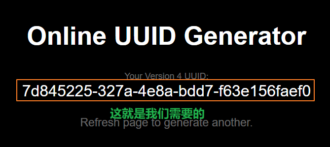

当然还可以修改端口，如下图所示：

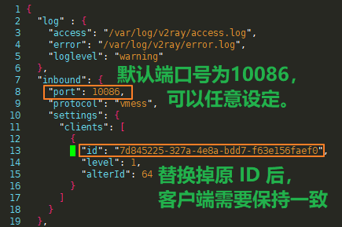

#### 2-3-2Shadowsocks

Shadowsocks 的端口配置支持1000-1010这种形式的连续多端口配置。

```
  "inbounds": [
    {
      "protocol": "shadowsocks",
      "port": 444, // 监听 444 端口
      "settings": {
        "method": "aes-256-cfb",  // 加密方式
        "password": "yearliny"    // 密码，必须和客户端相同
      }
    }
  ],
```

V2Ray的json配置文件支持 //、/* */形式的注释，所以不需要删除注解也可以运行，当你的文本编辑器支持 json 的语法检查时可能会对注释报错，不用理会，V2Ray会正确的处理它。

目前 V2Ray 支持的加密方式很多，以下仅推荐两种：

- aes-256-gcm：PC端推荐，安全
- chacha20-ietf：移动端推荐，更省电，更快速，良好的加密性

#### 2-3-1、永久运行

如果一致跟着教程走，我们已经配置了 Systemd，成功配置完成后我们需要使用它来管理 V2Ray 的运行，需要掌握的命令就以下几条：

###### 启用和禁用

注意启用和禁用并不会直接影响当下 V2Ray 的运行，启用状态时 V2Ray 崩溃会自动重新运行，开机会自动运行 V2Ray。

```
sudo systemctl enable v2ray
sudo systemctl disable v2ray
```

###### 启动、停止、重启V2Ray

```
sudo systemctl start v2ray
sudo systemctl stop v2ray
sudo systemctl restart v2ray
```

###### 查看状态

```
sudo systemctl status v2ray
```

## 三、客户端的使用

### 3-1Windows

#### 3-1-1安装

我们在 Github 下载 V2Ray，打开链接 https://github.com/v2ray/v2ray-core/releases ，往下翻找到 v2ray-windows-64.zip，意思为这个是 Windows 64 位系统的客户端，如果你的系统是 64 位当然可以选择 v2ray-windows-64.zip。

.zip，意思为这个是 Windows 32 位系统的客户端，如果你的系统是 64 位当然可以选择 v2ray-windows-64.zip。

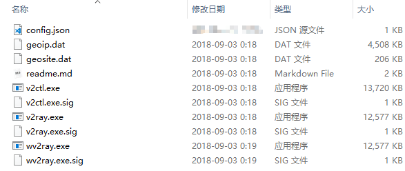

#### 3-1-2配置

下载完成后，我们找一个地方进行解压，这里我是在 C 盘创建一个文件夹 tools，然后把 V2Ray 解压到其中。进入我们解压好的文件夹修改 config.json 文件，删除原先的内容并完整的复制下方内容粘贴进去。

```
{
  "log": {
    "loglevel": "info"
  },
  "inbounds": [
    {
      "port": 1080,
      "protocol": "socks",
      "sniffing": {
        "enabled": true,
        "destOverride": [
          "http",
          "tls"
        ]
      },
      "settings": {
        "udp": true // 开启 UDP 协议支持
      }
    },
    {
      "port": 8080,
      "protocol": "http",
      "sniffing": {
        "enabled": true,
        "destOverride": [
          "http",
          "tls"
        ]
      }
    }
  ],
  "outbounds": [
    {
      "tag": "proxy-vmess",
      "protocol": "vmess",
      "settings": {
        "vnext": [
          {
            "address": "8.8.8.8", // 服务器的 IP
            "port": 443, // 服务器的端口
            "users": [
              {
                // id 就是 UUID，相当于用户密码
                "id": "7d4c4078-e129-416b-a483-cf5713a96a66",
                "alterId": 4
              }
            ]
          }
        ]
      }
    },
    {
      "tag": "direct",
      "settings": {},
      "protocol": "freedom"
    }
  ],
  "dns": {
    "server": [
      "8.8.8.8",
      "1.1.1.1"
    ],
    // 你的 IP 地址，用于 DNS 解析离你最快的 CDN
    "clientIp": "203.208.40.63"
  },
  // 配置路由功能，绕过局域网和中国大陆地址
  "routing": {
    "domainStrategy": "IPOnDemand",
    "rules": [
      {
        "type": "field",
        "domain": [
          // 默认跳过国内网站，如果想要代理某个国内网站可以添加到下列列表中
          "cnblogs.com"
        ],
        "outboundTag": "proxy-vmess"
      },
      {
        "type": "field",
        "domain": [
          "geosite:cn"
        ],
        "outboundTag": "direct"
      },
      {
        "type": "field",
        "outboundTag": "direct",
        "ip": [
          "geoip:cn",
          "geoip:private"
        ]
      }
    ]
  }
}
```

alterId 这个值不能超过服务器端所指定的值，否则无法正常使用。如果没有填写则默认值为 0。一般情况下使用自动脚本安装服务端 V2Ray 生成的配置文件中 alterId 值为 64，**客户端的填写推荐值为 4**。

上述配置中仅需要把 IP、 port 和 id（UUID） 修改成之前安装时的内容，保存后直接运行 v2ray.exe。把你的系统代理设置成 socks5 127.0.0.1:1080 或者 http 127.0.0.1:8080 ，就可以正常使用了。

此时此刻 V2Ray 客户端已经正常运行，我们配置一下系统，让它使用我们的代理即可。一张图讲解 Win10 设置系统代理的方法：

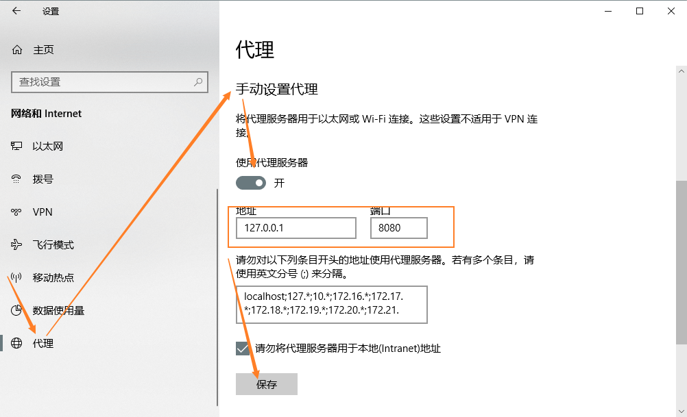

打开设置——网络和 Internet——代理，进行如上设置即可。可以看的出来，这里我是使用的 http 127.0.0.1:8080，而不是 socks 协议，因为系统对 http 代理的支持更好。

设置完成后，你对一切都非常满意，但是觉得 V2Ray 的那个黑糊糊的命令行窗口十分碍眼，OK，关闭这个窗口，双击 wv2ray.exe 运行即可。二者完全一样，只是 wv2ray.exe 没有窗口。

#### 3-1-3开机启动

最后你还想要它能开机自己启动，而不是自己每次都要点，so easy。按下快捷键 WIN+R，输入 shell:startup 回车，这个时候会打开一个文件夹，这个文件里中放入任何程序都会开机时运行。

当然不能直接把 wv2ray.exe 直接放进去，我们对着它右键——创建快捷方式，把创建的快捷方式放入到那个文件夹中就完成了。

Windows键(Winkey)，简称“Win键”，是在计算机键盘左下角 Ctrl 和 Alt 键之间的按键，图案是 Microsoft Windows 的视窗图标。 现在大多数运行 Windows 的 PC 键盘上都有这个按键。

#### 3-1-4进阶（可选）

经过上列的步骤，我们已经可以访问 Google 了，但是对此你仍然不满足，想要对什么网站用代理有个更详尽的把控。

这就需要浏览器插件来完成了，Chrome的扩展 [Omega](https://chrome.google.com/webstore/detail/proxy-switchyomega/padekgcemlokbadohgkifijomclgjgif?utm_source=chrome-ntp-icon) 或者 Firefox 的 [Proxy SwitchyOmega ](https://addons.mozilla.org/zh-CN/firefox/addon/switchyomega)，这两款实际上是同一个插件。其中配置成socks 127.0.0.1:1080就好了。如果在服务端配置中还加上了Shadowsocks的支持，那么也可以直接使用Shadowsocks的客户端。

[GFWList](https://raw.githubusercontent.com/gfwlist/gfwlist/master/gfwlist.txt) 是一个有用的东西，可以帮助代理仅仅被屏蔽的内容，我们可以结合[Omega](https://chrome.google.com/webstore/detail/proxy-switchyomega/padekgcemlokbadohgkifijomclgjgif?utm_source=chrome-ntp-icon) 和 [GFWList](https://raw.githubusercontent.com/gfwlist/gfwlist/master/gfwlist.txt) 来配置自动代理，甚至可以使用 [Omega](https://chrome.google.com/webstore/detail/proxy-switchyomega/padekgcemlokbadohgkifijomclgjgif?utm_source=chrome-ntp-icon) 生成 PAC 文件来设定系统级别的自动代理。

想要了解更多有关于 SwitchyOmega 的用法和介绍？参考：[SwitchyOmega 使用教程](https://yearliny.com/switchyomega-tutorial/)

### 3-2安卓Android

想了解更详细 V2Ray 安卓端 BifrostV 的用法，请参阅：[V2Ray安卓端使用教程](https://yearliny.com/v2ray-android-tutorial/)

目前可用的客户端有[v2rayNG](https://apkpure.com/cn/v2rayng/com.v2ray.ang)、[BifrostV](https://apkpure.com/cn/bifrostv/com.github.dawndiy.bifrostv)、[Actinium](https://apkpure.com/cn/actinium-v2ray-client/com.v2ray.actinium)。如果你对上述客户端没有了解，那么我推荐你使用**BifrostV**，它的UI界面相对更加完善，整体布局设计模仿了安卓版Shadowsocks，当你使用过安卓版Shadowsocks时使用这个软件就不存在太多障碍。

同时支持 VMess、Shadowsocks、SOCKS  等协议，也就是说上述协议的连接只要一个客户端就可以搞定了。APP有少量广告（设置中有关闭广告选项，但需要Google  Play的支持），希望用户可以理解开发者的劳动成果，包容那点广告或选择捐赠支持开发者。

- 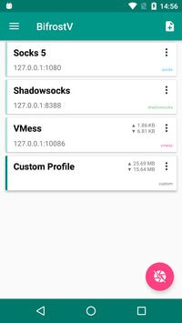
- 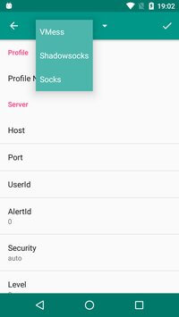

[BifrostV](https://apkpure.com/cn/bifrostv/com.github.dawndiy.bifrostv)下载链接在此（适用于无法使用Google Play的用户）

上述APP都可以去Google Play下载安装。对于无法使用Google Play的人，建议使用 [APKPure](https://apkpure.com/cn/) ，这是一个以 Google Play 中的安装包源为基础的软件商店，优点在于支持中文、可以下载干净的APK，无侵入式广告，~~可以无网络障碍的使用~~。

### 3-3Linux系统下客户端配置(仅适用于Linux桌面端用户)

V2Ray 客户端和服务端的文件是一体的，你仍然可以复用上列在服务器端安装、运行 V2Ray 的方法，唯一的不同之处在于配置文件 config.json。

使用自动脚本安装，因为是从 Github 下载安装包，所以要求机器本身能够访问自由互联网。此时可以把自动安装脚本 go.sh 下载下来，用些手段下载 V2Ray  压缩包，然后使用 ./go.sh –local v2ray.zip 命令安装本地名为 v2ray.zip 的文件。

#### 3-3-1V2Ray Vmess配置

我们可以复用原先的 **3-1-2配置** 部分的配置，把它完整复制粘贴进 config.json 并覆盖原先的内容。

这份配置文件中，我们可以通过两种方式连接我们设定的代理：

- socks://127.0.0.1:1080
- http://127.0.0.1:8080

一直到这里，我们已经完完全全配置好了 V2Ray，但是你还是不能直接打开浏览器就访问谷歌，因为你还没有让目标软件使用代理。

#### PAC 自动代理（推荐）

还有个问题就是，Windows 客户端一般都有自动设置PAC系统代理，这种方式代理有个好处就是不需要浏览器插件就可以**分网站使用代理**，并且对于大多数桌面软件也可以自动应用代理规则，实际上 Linux 也支持这种功能，只是缺少简单的方法去实现这个，要多费些功夫。

先回到上一节 **3-1Windows** 的内容，根据自己使用的浏览器安装我们需要的插件，实际上  Firefox 和 Chrome 的那两个插件是同一个，仅仅是名字有点出入。安装完毕后我们进入插件的配置页面，设定默认自带配置 Proxy 为  socks5 协议 127.0.0.1 地址 1080 端口，然后点击 Apply changes 使设定生效。

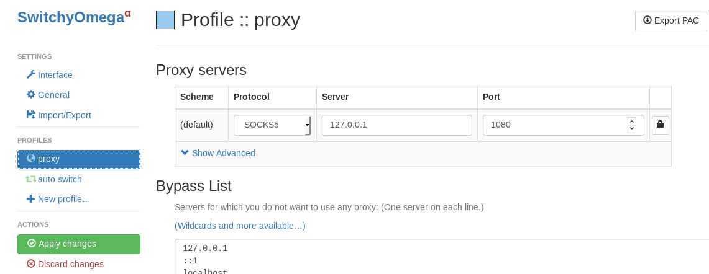

接着配置 auto switch，需要设置的仅有三点需要注意：

1. Rule list rules 设定为proxy。意为符合规则的走我们设定的代理。
2. Default 设定为 Direct。意为不符合规则的直接连接。
3. Rule List URL 粘贴进去 https://raw.githubusercontent.com/gfwlist/gfwlist/master/gfwlist.txt，然后点击Download Profile Now。

点击 Apply changes 使设定生效，然后点击右上角的 Export PAC 导出我们的代理规则。

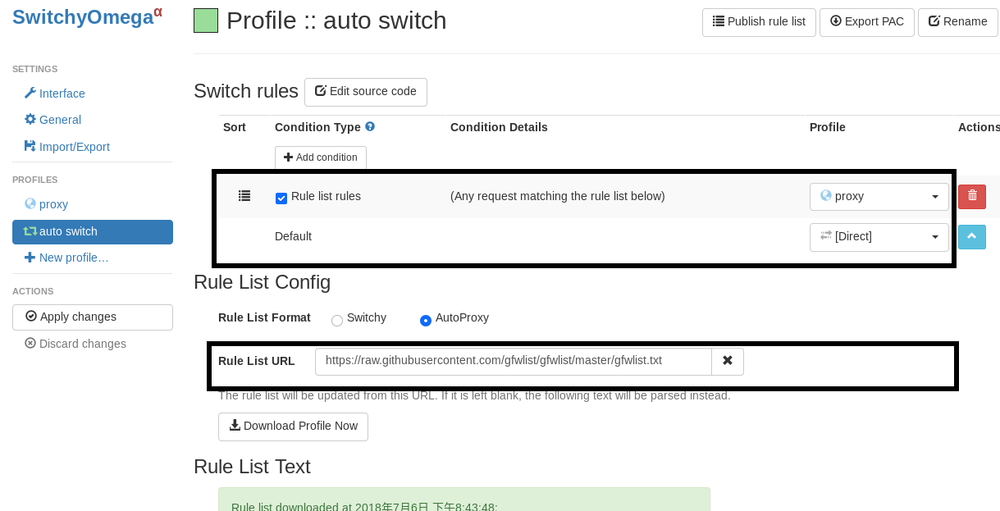

最后设定PAC代理方面，不同的Linux桌面环境会有区别，可以自行搜索关键词：设置pac “系统名+版本号”。这里以Ubuntu18.04作为示范：

打开设置—Network—Network  Proxy，选择Automatic模式，填入file://pac文件绝对路径，如果你的pac配置文件放到了/etc/v2ray/proxy.pac，那么就填入:file:///etc/v2ray/proxy.pac。

## 四、简单问题排查

遇到的问题五花八门，但就目前的经验来看，大多数人的错误所在都在于并未严格遵循本文的系统环境和配置。

当你遇到问题的时候，首先需要检查服务端V2Ray 是否正常运行，但只要你正确配置，一般很少出现无法运行的情况，即使是意外崩溃也可以自己重启运行。

如果对英语有一定理解能力，并且懂点计算机常识，那么通过查日志你就可以解决大多数问题。如果你想要其他人帮助你解决问题，准确而具体的描述你所遭遇的情况，并且附上日志文件和配置文件都可以让别人更快速的看出你的问题所在。

### 4-1获取日志

要想对问题进行更准确的定位，大多数时候都要求展示你的配置和运行日志，然而很多人却不知道运行日志在哪获取，获取方法其实很简单。

#### 4-1-1服务端日志

服务端的日志形式是在 config.json 配置文件中进行设定的，如果配置文件中存在类似于下方的字段：

```
"log": {
    "loglevel": "warning",
    "access": "/var/log/v2ray/access.log",
    "error": "/var/log/v2ray/error.log"
  }
```

那么服务端的日志存在于 /var/log/v2ray 目录下，这个目录下存在两个文件：

- access.log：包含正常连接的消息
- error.log：仅包含错误连接的消息

在排查问题的时候，error 日志可能会有很长的内容，这种时候仅需要最底部的十几行内容（越靠下意味着内容越新），在 Linux 系统下我们使用 tail 工具去查看日志，默认只显示文件底部 10 行内容。

```
sudo tail /var/log/v2ray/error.log
```

如果没有在配置文件中写明 log 重定向到文件，那么我们可以使用 journalctl 工具查看：

```
sudo journalctl -b -u v2ray
```

#### 4-1-2客户端日志

对于 Windows 系统，如果你使用的是官方 V2Ray 客户端并且是按照我的配置进行设置，那么你的日志信息只是会在 v2ray.exe 程序运行的命令行窗口中打印出来。

如果你的客户端也是 Linux，那么按照 **4-1-1服务端日志** 的方法即可。

### 4-2检查服务端是否运行

```
systemctl status v2ray
```

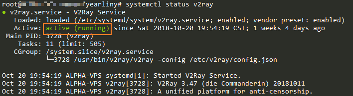

有 active（running） 这样的字样说明是正常运行。

## 五、常见问题FAQ

### 为什么 V2Ray 比 SS/SSR 速度慢？

一般来说 V2Ray 的性能是要优于 SS/SSR 的，如果你的速度很慢可以参考如下原因：

本文的部分讲解中，为了保持最优的系统兼容性，我们使用的是 http 协议 127.0.0.1:8080  进行代理，为了保持最优的性能建议按照 3-1-4进阶配置中使用浏览器插件配合，使用 socks5://127.0.0.5:1080 socks5 协议的代理，保持最优的性能。

另外一种可能是 V2Ray 的路由功能，我们文中的配置使其可以自动绕过局域网和国内地址，为了获得准确的解析从而使得每次都要发送 DNS 请求到远程服务器进行解析。

性能最优的方式是放弃 V2Ray 的路由功能，V2Ray 不对请求做区分全部走代理，使用浏览器插件的方式实现国内网站直连，国外网站走代理。浏览器插件的实现方法还是如 **3-1-4进阶配置** 所说，并且需要把配置文件中的 dns、routing 这两个配置块删除。

## 使用建议

为了保证此类服务不被滥用，为了你我他请尽量遵循下列建议：

1. Win10 系统上自带杀软，请卸载国产杀软和管家，如360
2. 浏览器请使用 Chrome 或者 Firefox，避免使用 360 浏览器等
3. 在移动端，在夜间时请关闭代理连接，避免产生长时间连接，暴露流量特征
4. 搭建的服务请勿公开，给有限的人使用

------

**写在最后**：如果你发现本文有错误或有任何疑问，请在下方评论区中指出。大多数情况都能保持一天之内进行回复，注意你的邮箱收到的作者回复提醒