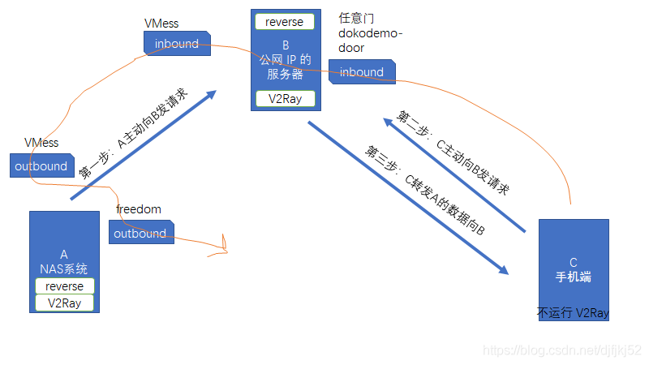

cd /usr/local/etc/v2ray/

 cd /etc/nginx/conf/conf.d/

整个通信中采用了VLESS  + https


# 配置端口代理示意图




## 全局代理与端口代理的服务端配置


v2ray:

```json


{
  "reverse":{  //这是 B 的反向代理设置，必须有下面的 portals 对象
    "portals":[
      {
        "tag":"portal",
        "domain":"private.cloud.com"        // 必须和上面 A 设定的域名一样
      }
    ]
  },


  "log": {
        "access": "/var/log/v2ray/access.log",
        "error": "/var/log/v2ray/error.log",
        "loglevel": "warning"
    },
  "inbounds": [

    {
     // 接受 C 的inbound
      "tag":"external", // 标签，路由中用到
      "port":8891,
      // 开放 8891 端口，用于接收外部的 HTTP 访问 
      "protocol":"dokodemo-door",
        "settings":{
          "address":"127.0.0.1",
          "port":8891, //假设 NAS 监听的端口为 8891
          "network":"tcp"
        }
    },

    {
     // 接受 C 的inbound
      "tag":"external2", // 标签，路由中用到
      "port":8888,
      // 开放 8888 端口，用于接收外部的 HTTP 访问 
      "protocol":"dokodemo-door",
        "settings":{
          "address":"127.0.0.1",
          "port":8888, //假设 NAS 监听的端口为 8888
          "network":"tcp"
        }
    },


    {
    "port":36090,
      "listen": "127.0.0.1",
      "tag": "VLESSInFromC",
      "protocol": "VLESS",
      "settings": {
        "clients": [
          {
          "id":"a08a95f7-b961-4762-a7e8-fc3a871cf506",
            "alterId": 0
          }
        ],
            "decryption": "none"
      },
      "streamSettings": {
        "network": "ws",
        "wsSettings": {
          "path":"/bin/"
        }
      }
    },

    {
    "port":36089,
      "listen": "127.0.0.1",
      "tag": "VLESS-in",
      "protocol": "VLESS",
      "settings": {
        "clients": [
          {
          "id":"067e898d-2597-48ae-8adb-575ac4d6e0c6",
            "alterId": 0
          }
        ],
            "decryption": "none"
      },
      "streamSettings": {
        "network": "ws",
        "wsSettings": {
          "path":"/bd/"
        }
      }
    }
  ],
  "outbounds": [
    {
      "protocol": "freedom",
      "settings": { },
      "tag": "direct"
    },
    {
      "protocol": "blackhole",
      "settings": { },
      "tag": "blocked"
    }
  ],
  "dns": {
    "servers": [
      "https+local://1.1.1.1/dns-query",
          "1.1.1.1",
          "1.0.0.1",
          "8.8.8.8",
          "8.8.4.4",
          "localhost"
    ]
  },
  "routing": {
    "domainStrategy": "AsIs",
    "rules": [

      {  //路由规则，接收 C 请求后发给 A
        "type":"field",
        "inboundTag":[
          "external","external2"
        ],
        "outboundTag":"portal"
      },
      {  //路由规则，接收 C 的请求后发给 A
        "type":"field",
        "inboundTag":[  
          "VLESSInFromC"
        ],
        "outboundTag":"portal"
      },
      {  //路由规则，让 B 能够识别这是 A 主动发起的反向代理连接
        "type":"field",
        "inboundTag":[
          "VLESS-in"
        ],
        "domain":[
          "full:private.cloud.com"
        ],
        "outboundTag":"portal"
      },

      {
        "type": "field",
        "inboundTag": [
          "VLESS-in"
        ],
        "outboundTag": "direct"
      }
    ]
  }
}


```


nginx

```

```


# 客户端A（提供服务）


```
{
  "reverse":{ 
    // 这是 A 的反向代理设置，必须有下面的 bridges 对象
    "bridges":[  
      {  
        "tag":"bridge", // 关于 A 的反向代理标签，在路由中会用到
        "domain":"private.cloud.com" // A 和 B 反向代理通信的域名，可以自己取一个，可以不是自己购买的域名，但必须跟下面 B 中的 reverse 配置的域名一致
      }
    ]
  },


  "policy": {
    "system": {
      "statsOutboundUplink": true,
      "statsOutboundDownlink": true
    }
  },
  "log": {
    "access": "",
    "error": "",
    "loglevel": "none"
  },
  "inbounds": [
    {
      "tag": "socks",
      "port": 10808,
      "listen": "0.0.0.0",
      "protocol": "socks",
      "sniffing": {
        "enabled": false,
        "destOverride": [
          "http",
          "tls"
        ]
      },
      "settings": {
        "auth": "noauth",
        "udp": false,
        "allowTransparent": false
      }
    },
    {
      "tag": "http",
      "port": 10809,
      "listen": "0.0.0.0",
      "protocol": "http",
      "sniffing": {
        "enabled": true,
        "destOverride": [
          "http",
          "tls"
        ]
      },
      "settings": {
        "udp": false,
        "allowTransparent": false
      }
    },
    {
      "tag": "api",
      "port": 49676,
      "listen": "127.0.0.1",
      "protocol": "dokodemo-door",
      "settings": {
        "udp": false,
        "address": "127.0.0.1",
        "allowTransparent": false
      }
    }
  ],
  "outbounds": [
    {
      "tag": "proxy",
      "protocol": "vless",
      "settings": {
        "vnext": [
          {
            "address": "www.xxx.com",
            "port": 443,
            "users": [
              {
                "id": "067e898d-2597-48ae-8adb-575ac4d6e0c6",
                "alterId": 0,
                "email": "t@t.tt",
                "security": "auto",
                "encryption": "none",
                "flow": ""
              }
            ]
          }
        ]
      },
      "streamSettings": {
        "network": "ws",
        "security": "tls",
        "tlsSettings": {
          "allowInsecure": true,
          "serverName": "www.bing.com"
        },
        "wsSettings": {
          "path": "/bd/",
          "headers": {
            "Host": "www.bing.com"
          }
        }
      },
      "mux": {
        "enabled": false,
        "concurrency": -1
      }
    },
    {
      "tag": "direct",
      "protocol": "freedom",
      "settings": {}
    },
    {
      "tag": "block",
      "protocol": "blackhole",
      "settings": {
        "response": {
          "type": "http"
        }
      }
    }
  ],
  "stats": {},
  "api": {
    "tag": "api",
    "services": [
      "StatsService"
    ]
  },
  "dns": {
    "servers": [
      "8.8.8.8"
    ]
  },
  "routing": {
    "domainStrategy": "AsIs",
    "domainMatcher": "linear",
    "rules": [
      {
        "type": "field",
        "inboundTag": [
          "api"
        ],
        "outboundTag": "api"
      },
      {
        "type": "field",
        "outboundTag": "direct",
        "domain": [
          "domain:example-example.com",
          "domain:example-example2.com"
        ]
      },
      {
        "type": "field",
        "outboundTag": "block",
        "domain": [
          "geosite:category-ads-all"
        ]
      },
      {
        "type": "field",
        "outboundTag": "direct",
        "domain": [
          "geosite:cn"
        ]
      },
      {
        "type": "field",
        "outboundTag": "direct",
        "ip": [
          "geoip:private",
          "geoip:cn"
        ]
      },
      {
        "type": "field",
        "port": "0-65535",
        "outboundTag": "proxy"
      },
      {  
        // 配置 A 主动连接 B 的路由规则
        "type":"field",
        "inboundTag":[  
          "bridge"
        ],
        "domain":[  
          "full:private.cloud.com"
        ],
        "outboundTag":"proxy"
      },
      {  
        // 反向连接访问私有网盘的规则
        "type":"field",
        "inboundTag":[  
          "bridge"
        ],
        "outboundTag":"direct"
      }
    ]
  }
}
```


# 客户端C （任意客户）

输入地址：http://www.xxx.com:5900